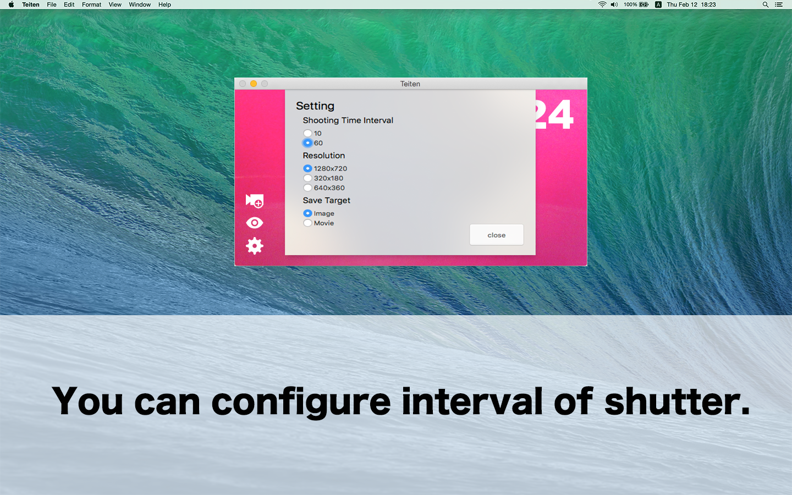

# Teiten

[Teiten](http://teiten.nakajijapan.net/) is an app that fixed-point observation a lot earnestly yourself by using a PC camera.

## Features

- You can capture a photo by each specified number of seconds.
- Shooting interval I offers 2 pattern.
- Saved images is converted to video.

## ScreenShots

## Author

- [nakajijapan](https://github.com/nakajijapan)

## License

Teiten is copyrighted free software by nakajijapan.
You can redistribute it and/or modify it under the terms of [the GPL version 2](https://github.com/psychs/limechat/blob/master/GPL.txt).
